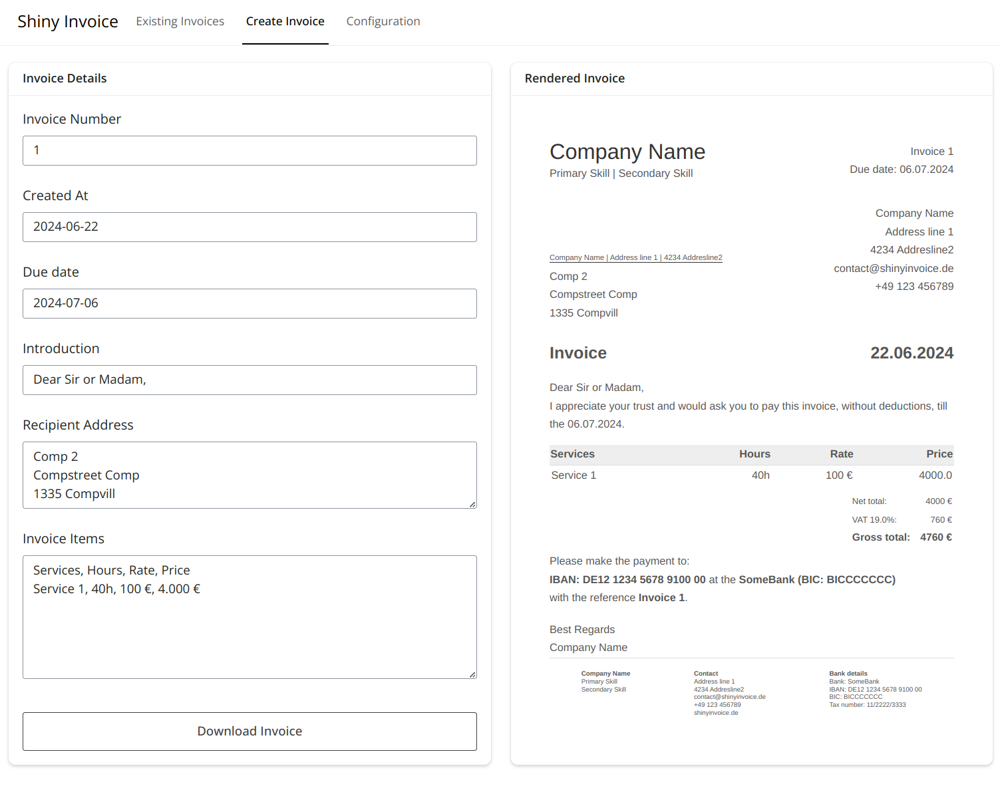
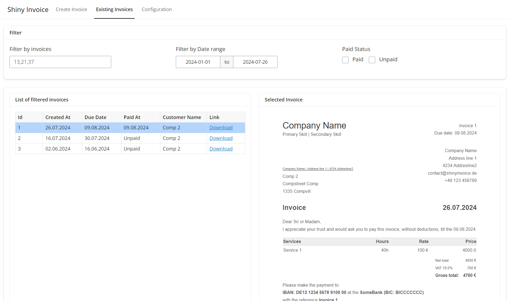

# Shiny Invoice

This tool is meant as a simple and naive way to manage invoices locally.
It is not meant to be published online and used as an enterprise tool.


## Run

To run `shiny-invoice` you need install it with:

```bash
pip install shiny-invoice
```

Once `shiny-invoice` is installed you need to create configuration file.
A suitable default configuration can be generated with
```bash
shiny-invoice generate-default-config
```

Once everything is set up you can run `shiny-invoice` with:

```bash
shiny-invoice run --config default_config.yaml
```

More information you can find with

```bash
shiny-invoice --help
shiny-invoice run --help
```

## Workflow

This application manages the invoices as plain html files, named by the invoice id.
To turn the html file into a pdf just use the browsers print functionality.
All the data corresponding to the invoices is stored inside a json file, which is configured with the key
`paths.datastore`.
The json you can edit as you like, via the gui it is only possible to change the 'Paid At' value.
This value is also used to determine if in invoice is indeed 'Paid' or 'Unpaid'.

## Impressions

### View of creating a new invoice


### View of existing invoices

